# ROS + Gazebo Sim demos

This package contains demos showing how to use Gazebo Sim with ROS.

## Run Gazebo Sim

There's a convenient launch file, try for example:

    ros2 launch ros_gz_sim gz_sim.launch.py gz_args:="shapes.sdf"


## Air pressure

Publishes fluid pressure readings.

    ros2 launch ros_gz_sim_demos air_pressure.launch.py

This demo also shows the use of custom QoS parameters. The sensor data is
published as as "best-effort", so trying to subscribe to "reliable" data won't
work. See the difference between:

    ros2 topic echo /air_pressure --qos-reliability best_effort

And

    ros2 topic echo /air_pressure --qos-reliability reliable


## Camera

Publishes RGB camera image and info.

Images can be exposed to ROS through `ros_gz_bridge` or `ros_gz_image`.

Using the image bridge (unidirectional, uses [image_transport](http://wiki.ros.org/image_transport)):

    ros2 launch ros_gz_sim_demos image_bridge.launch.py

Using the regular bridge:

    ros2 launch ros_gz_sim_demos camera.launch.py

To use a camera that only publishes information when triggered:

    ros2 launch ros_gz_sim_demos triggered_camera.launch.py

Trigger the camera:

    ros2 topic pub /camera/trigger std_msgs/msg/Bool "{data: true}" --once


## Diff drive

Send commands to a differential drive vehicle and listen to its odometry.

    ros2 launch ros_gz_sim_demos diff_drive.launch.py

Then unpause and send a command

    ros2 topic pub /model/vehicle_blue/cmd_vel geometry_msgs/msg/Twist "{linear: {x: 5.0}, angular: {z: 0.5}}"

This demo also shows the use of custom QoS parameters. The commands are
subscribed to as "reliable", so trying to publish "best-effort" commands
won't work. See the difference between:

    ros2 topic pub /model/vehicle_blue/cmd_vel geometry_msgs/msg/Twist "{linear: {x: 5.0}, angular: {z: 0.0}}" --qos-reliability reliable

And

    ros2 topic pub /model/vehicle_blue/cmd_vel geometry_msgs/msg/Twist "{linear: {x: 5.0}, angular: {z: 0.0}}" --qos-reliability best_effort

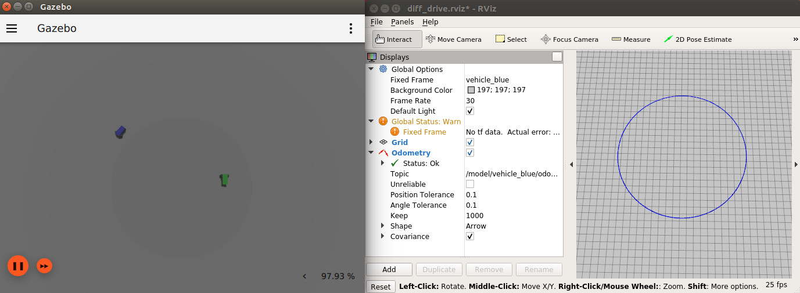

## Depth camera

Depth camera data can be obtained as:

* `sensor_msgs/msg/Image`, through `ros_gz_bridge` or `ros_gz_image`
* `sensor_msgs/msg/PointCloud2`, through `ros_gz_point_cloud`

Using the image bridge (unidirectional, uses [image_transport](http://wiki.ros.org/image_transport)):

    ros2 launch ros_gz_sim_demos image_bridge.launch.py image_topic:=/depth_camera

*TODO*: Blocked by `ros_gz_point_cloud` [issue](https://github.com/gazebosim/ros_gz/issues/40).

Using Gazebo Sim plugin:

    ros2 launch ros_gz_sim_demos depth_camera.launch.py

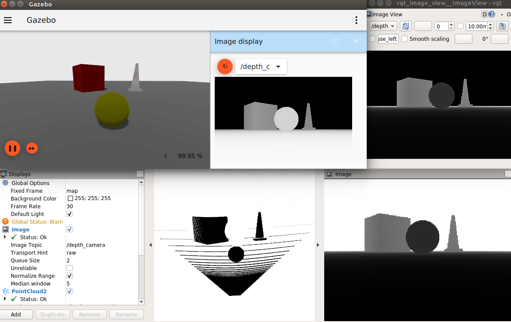

## GPU lidar

GPU lidar data can be obtained as:

* `sensor_msgs/msg/LaserScan`, through the `ros_gz_bridge`
* `sensor_msgs/msg/PointCloud2`, through the `ros_gz_bridge` or `ros_gz_point_cloud`

Using the bridge:

    ros2 launch ros_gz_sim_demos gpu_lidar_bridge.launch.py

*TODO*: Blocked by `ros_gz_point_cloud` [issue](https://github.com/gazebosim/ros_gz/issues/40).

Using Gazebo Sim plugin:

    ros2 launch ros_gz_sim_demos gpu_lidar.launch.py

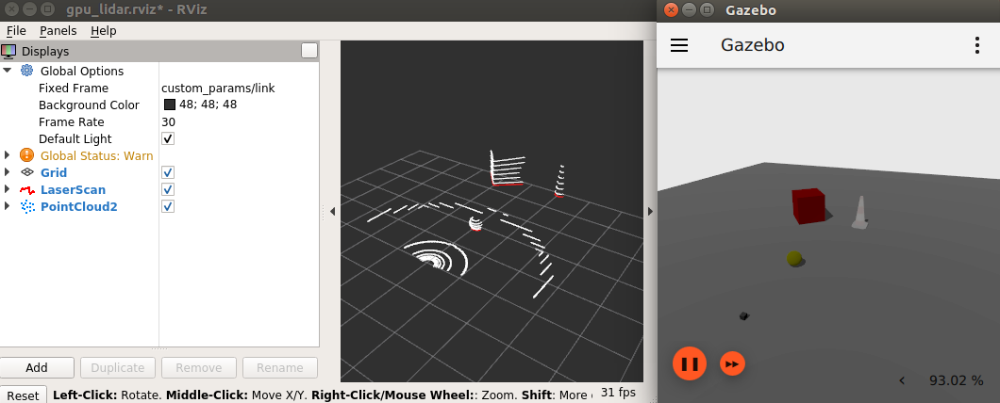

## IMU

Publishes IMU readings.

    ros2 launch ros_gz_sim_demos imu.launch.py

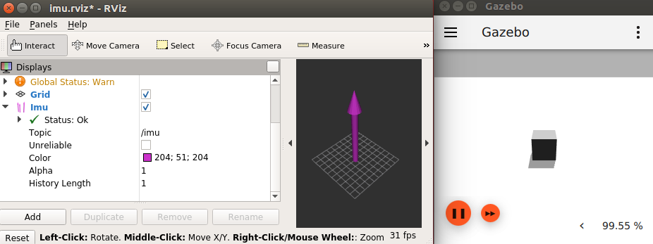

*TODO*: IMU display missing for RViz2

## Magnetometer

Publishes magnetic field readings.

    ros2 launch ros_gz_sim_demos magnetometer.launch.py

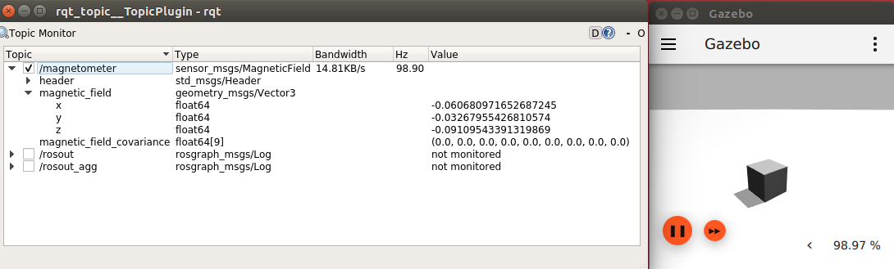

## GNSS

Publishes satellite navigation readings, only available in Fortress on.

    ros2 launch ros_gz_sim_demos navsat.launch.py

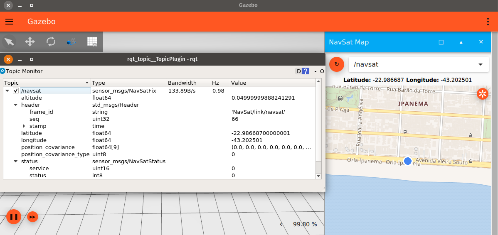

## RGBD camera

RGBD camera data can be obtained as:

* `sensor_msgs/msg/Image`, through `ros_gz_bridge` or `ros_gz_image`
* `sensor_msgs/msg/PointCloud2`, through `ros_gz_bridge` or `ros_gz_point_cloud`

Using the image bridge (unidirectional, uses [image_transport](http://wiki.ros.org/image_transport)):

    # RGB image
    ros2 launch ros_gz_sim_demos image_bridge.launch.py image_topic:=/rgbd_camera/image
    # Depth image
    ros2 launch ros_gz_sim_demos image_bridge.launch.py image_topic:=/rgbd_camera/depth_image

Using the regular bridge:

    ros2 launch ros_gz_sim_demos rgbd_camera_bridge.launch.py

*TODO*: Blocked by `ros_gz_point_cloud` [issue](https://github.com/gazebosim/ros_gz/issues/40).

Using Gazebo Sim plugin:

    ros2 launch ros_gz_sim_demos rgbd_camera.launch.py

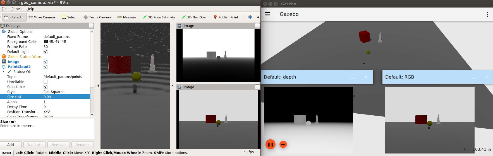

## Battery

Get the current state of a battery.

    ros2 launch ros_gz_sim_demos battery.launch.py

Then send a command so the vehicle moves and drains the battery

    ros2 topic pub /model/vehicle_blue/cmd_vel geometry_msgs/msg/Twist "{linear: {x: 5.0}, angular: {z: 0.5}}"


## Robot description publisher

Leverage the robot description publisher to spawn a new urdf model in gazebo and
show it in rviz2.
To try the demo launch:

    ros2 launch ros_gz_sim_demos robot_description_publisher.launch.py


## Joint States Publisher

Publishes joint states of the robot.

To try the demo launch:

    ros2 launch ros_gz_sim_demos joint_states.launch.py


## Bridging joint state and pose publishers

The launch file demonstrates bridging Gazebo poses to TFMessage to visualize the pose
and transforms of a robot in rviz.

To try the demo launch:

    ros2 launch ros_gz_sim_demos tf_bridge.launch.py

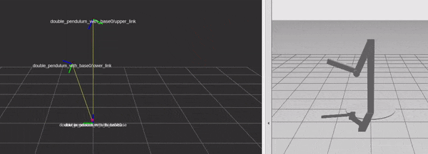

## Managing Entities

The `ros_gz_sim` package provides a set of utilities for managing entities (models, lights, links, etc.) in Gazebo simulations through ROS 2.
This package enables seamless communication between ROS 2 and Gazebo, allowing you to:

- **Spawn entities**: Add new models and objects to a running Gazebo simulation
- **Set entity poses**: Dynamically adjust the position and orientation of existing entities
- **Delete entities**: Remove entities from the simulation environment

### Launching Gazebo

```bash
gz sim -v 4 ~/ros2_ws/src/ros_gz/ros_gz_sim_demos/worlds/default.sdf
```

### 1. Spawning Entities

Spawn new entities into the simulation:

1. Run the ROS-Gazebo bridge for the spawn service:

```bash
ros2 run ros_gz_bridge parameter_bridge /world/default/create@ros_gz_interfaces/srv/SpawnEntity
```

2. Spawn your entity:

```bash
ros2 run ros_gz_sim spawn_entity --name <model_name> --sdf_filename <path_to_sdf_file> [--pos x y z] [--quat x y z w | --euler roll pitch yaw]
```

**Example:**

```bash
ros2 run ros_gz_sim spawn_entity --name cardboard_box --sdf_filename $(ros2 pkg prefix ros_gz_sim_demos)/share/ros_gz_sim_demos/models/cardboard_box/model.sdf --pos 1.0 2.0 0.5 --euler 0.0 0.0 1.57
```

or

```bash
ros2 run ros_gz_sim spawn_entity --name cardboard_box --sdf_filename /full/path/to/ros_gz_ws/src/ros_gz_sim_demos/models/cardboard_box/model.sdf --pos 1.0 2.0 0.5 --euler 0.0 0.0 1.57
```

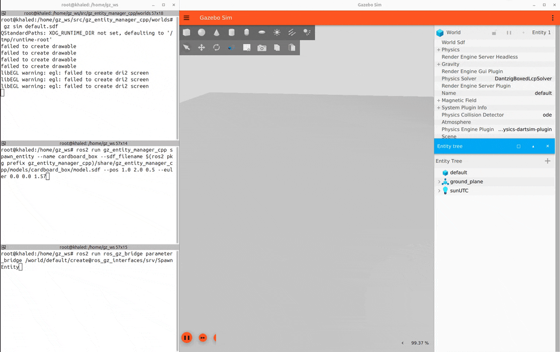

### 2. Setting Entity Poses

Dynamically adjust the position and orientation of existing entities:

1. Run the ROS-Gazebo bridge for the set pose service:

```bash
ros2 run ros_gz_bridge parameter_bridge /world/default/set_pose@ros_gz_interfaces/srv/SetEntityPose
```

2. Set the entity's pose:

```bash
ros2 run ros_gz_sim set_entity_pose [--name NAME | --id ID] [--type TYPE] [--pos X Y Z] [--quat X Y Z W | --euler ROLL PITCH YAW]
```

**Examples:**

Using entity name with Euler angles for rotation:

```bash
ros2 run ros_gz_sim set_entity_pose --name cardboard_box --pos 3.0 4.0 1.0 --euler 0.0 0.0 1.57
```

Using entity ID with quaternion for rotation:

```bash
ros2 run ros_gz_sim set_entity_pose --id 8 --pos 3.0 4.0 1.0 --quat 0.0 0.0 0.7071 0.7071
```

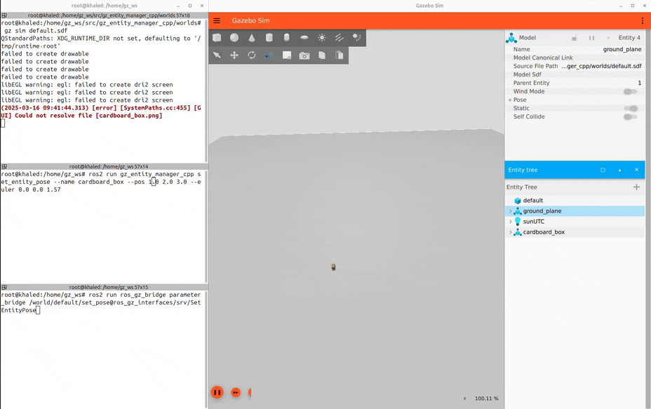

### 3. Deleting Entities

Remove entities from the simulation:

1. Run the ROS-Gazebo bridge for the delete service:

```bash
ros2 run ros_gz_bridge parameter_bridge /world/default/remove@ros_gz_interfaces/srv/DeleteEntity
```

2. Delete the entity:

```bash
ros2 run ros_gz_sim delete_entity [--name NAME | --id ID] [--type TYPE]
```

**Examples:**

Using entity name:

```bash
ros2 run ros_gz_sim delete_entity --name cardboard_box
```

Using entity ID:

```bash
ros2 run ros_gz_sim delete_entity --id 8
```

Using a specific entity type:

```bash
ros2 run ros_gz_sim delete_entity --name cardboard_box --type 2
```

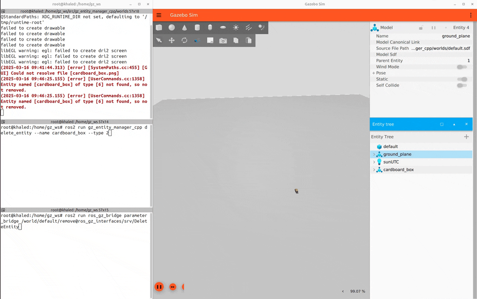

### Entity Type Reference

When using the `set_entity_pose` and `delete_entity` commands, you can specify the entity type using the `--type` flag. The following type values are available:

| Value | Entity Type |
|-------|-------------|
| 0     | NONE        |
| 1     | LIGHT       |
| 2     | LINK        |
| 3     | VISUAL      |
| 4     | COLLISION   |
| 5     | SENSOR      |
| 6     | MODEL (default) |
